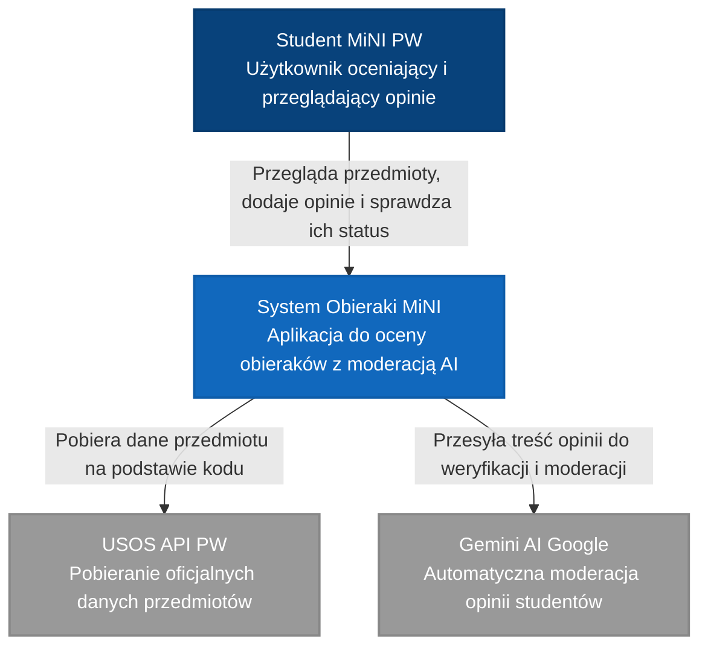
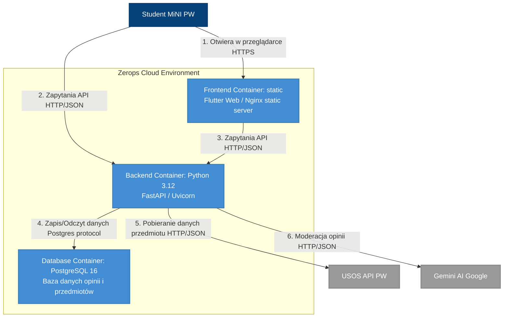
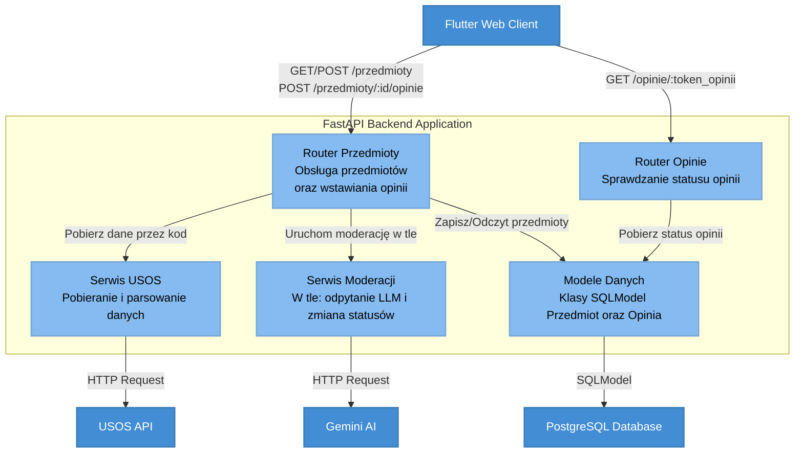
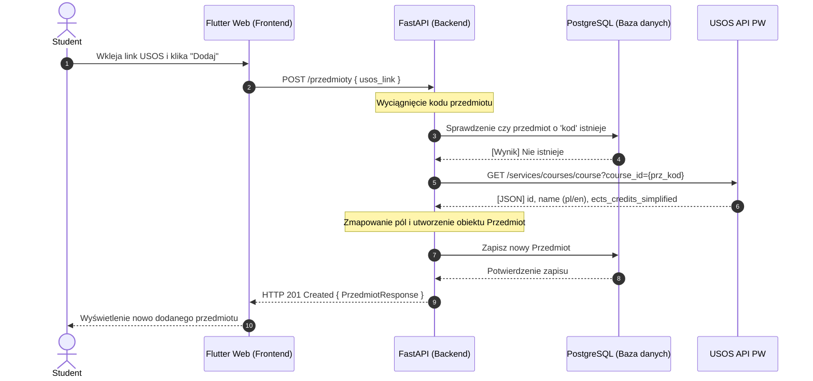
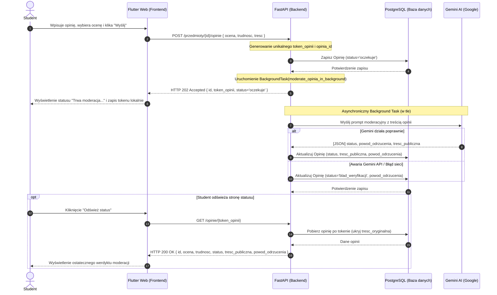
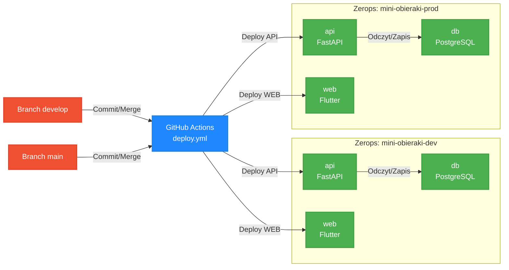

# Architektura Systemu — Obieraki MiNI

Dokument opisuje architekturę systemu **Obieraki MiNI** — aplikacji dedykowanej dla studentów Wydziału Matematyki i Nauk Informacyjnych Politechniki Warszawskiej do opiniowania i oceniania przedmiotów obieralnych.

---

## 1. Wprowadzenie i Stos Technologiczny

System został zaprojektowany z myślą o pełnej anonimowości studentów, przy jednoczesnym wyeliminowaniu spamu i wulgaryzmów dzięki zastosowaniu nowoczesnych modeli LLM do automatycznej moderacji i ewentualnego przeredagowywania opinii w tle.

| Warstwa | Technologia / Narzędzie |
| :--- | :--- |
| **Frontend** | **Flutter Web** |
| **Backend** | **FastAPI** |
| **Baza danych** | **PostgreSQL** |
| **Moderacja** | **Gemini 3.5 Flash** |
| **Infrastruktura** | **Zerops Cloud Platform** |
| **CI / CD** | **GitHub Actions** |

---

## 2. Diagramy C4 Model

Poniższe diagramy przedstawiają system z perspektywy architektury C4.

### Poziom 1: Diagram Kontekstu

Wskazuje relacje systemu **Obieraki MiNI** z użytkownikiem końcowym (Studentem) oraz dwoma zewnętrznymi platformami API.

### Poziom 2: Diagram Kontenerów

Pokazuje fizyczne i logiczne granice systemu rozbite na poszczególne kontenery uruchomione w chmurze Zerops.

### Poziom 3: Diagram Komponentów backendu

Obrazuje wewnętrzną strukturę kodu aplikacji FastAPI, rozróżniając warstwy routingu, logiki biznesowej oraz dostępu do danych.

---

## 3. Przepływy Danych

Poniższe diagramy szczegółowo opisują dwie najważniejsze operacje biznesowe w systemie.

### Ścieżka A: Dodawanie Przedmiotu przez Link USOS

Użytkownik podaje link USOS, a system automatycznie parsuje kod przedmiotu i pobiera jego parametry bezpośrednio z bazy danych PW.

### Ścieżka B: Dodawanie Opinii i Asynchroniczna Moderacja LLM

Gwarantuje bezproblemowe działanie frontendu poprzez asynchroniczne odpytanie Gemini AI w zadaniu w tle (Background Task). Użytkownik natychmiastowo otrzymuje identyfikator (token), którym weryfikuje postęp weryfikacji.

---

## 4. Topologia Wdrożenia

Przedstawia organizację dwóch w pełni odizolowanych środowisk chmurowych (deweloperskiego oraz produkcyjnego) zintegrowanych z gałęziami systemu Git.

## 5. Uzasadnienie wyboru technologii

Decyzje wynikają z trzech ograniczeń projektu: dokumentacja API w Swaggerze jako wymaganie,
dane o realnych osobach prowadzących (więc rezydencja danych i RODO) oraz dwuosobowy zespół
dzielący się na front i backend. Poniżej jak te ograniczenia przełożyły się na wybory.

### Hosting: Zerops
Hosting wybraliśmy jako pierwszy, bo pociągnął za sobą resztę. Zerops trzyma dane w EU, co przy
opiniach dotyczących konkretnych wykładowców załatwia rezydencję danych i RODO bez kombinowania.
W jednym projekcie dostajemy runtime backendu, zarządzanego Postgresa i prywatną sieć między
nimi, więc nie składamy infrastruktury z kilku dostawców.

### Baza: PostgreSQL
Postgres wynikł wprost z Zeropsa, gdzie jest usługą zarządzaną z backupami, więc nie utrzymujemy
bazy własnymi siłami. Zaczęliśmy od SQLite, ale SQLite był dobry na początek aczkolwiek nie pozwalał na przetrwanie danych pomiędzy restartami kontenera.

### Backend: FastAPI
Dokumentacja API w Swaggerze była wymaganiem, a FastAPI w prosty sposób generuje OpenAPI.

### Frontend: Flutter
Front pisze osoba, która ma duże doświadczenie we Flutterze, więc był to naturalny wybór technologii pozwalającej na osiągnięcie celu co do której mamy doświadczenie.

### Źródła danych: USOS API i Gemini
USOS API jest źródłem prawdy o przedmiotach (nazwa, ECTS), pobieranym po `prz_kod`. Świadomie
bierzemy z niego tylko dane, do których mamy prawo, a po pełny opis i sylabus linkujemy do
USOSweb zamiast je kopiować. Gemini odpowiada za moderację: niekulturalne opinie przepisuje do
wersji publikowalnej, zamiast je odrzucać, co odróżnia produkt od zwykłego filtra słów. Chcieliśmy najpierw scrapować USOS-a ale plik robots.txt nie pozwalał na to, na szczęście znaleźliśmy api.

Konkretnie używamy **Gemini 3.5 Flash** - LLM rozumie kontekst opinii (przepisuje zamiast odrzucać), darmowy tier 5 RPM wystarczający dla projektu, dobre wyniki na polskim.

### CI/CD: GitHub Actions
Wdrożenia idą przez GitHub Actions, gdzie testy backendu są bramką przed deployem, a gałąź
wyznacza środowisko: `develop` wdraża się na dev, `main` na prod. Wynika to z posiadanego doświadczenia w zespole co do takiej formy dostarczania kolejnych wersji na środowiska.

---
